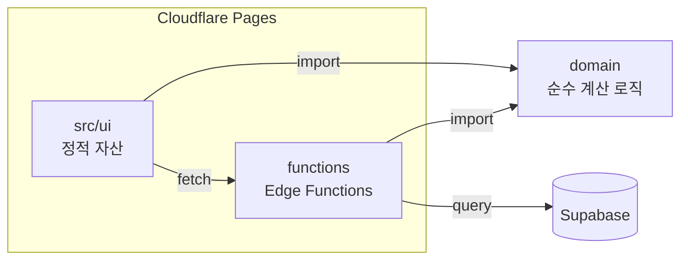

# Dutch Pay

### 함께한 지출을 간편하게 정산해주는 서비스
[DutchPay 바로가기](https://dutchpay.site/)

<br />

## 💵 기획 배경
**친구, 동료들과 식사나 여행을 다녀오면, 항상 정산이 마지막 숙제입니다** <br/>
영수증을 보며 누가 뭘 먹었는지 대조해 계산기를 두드리고, 각자에게 보낼 금액을 따로 전달한 뒤 누가 보냈는지 확인해야 했습니다 <br />
인원이 많아지거나 항목별로 먹은게 다르면 계산 실수도 잦았습니다 <br/>
이 반복되는 번거로움을 줄이고 싶어서 Dutch Pay를 만들었습니다 <br/>

<br />

## ⭐️ 핵심 기능
### 모두가 방장이 될 수 있고, 정산할 수 있어요
> 누구든 언제나 최종 결제자가 될 수 있어요! 정산 완료되었을 때 입금 받으실 계좌번호를 등록해주세요!


### 정산방을 만들어 친구와 동료들을 초대해보세요
> 최종 결제한 사람이 방을 만들고, 정산방 링크를 복사하여 친구와 동료들을 초대해보세요!


### 정산 항목을 추가하고, 체크해보세요
> 자신이 지불해야 할 항목에 체크하면 최종 결제 금액이 나와요!


### 참여자들이 정산에 대한 완료를 했다면, 방장이 정산 완료를 할 수 있어요
> 방장이 정산 완료 버튼을 누르면 방장은 받을 금액, 참여자들은 각자 지불해야 할 금액이 떠요! 토스페이로 간단하게 송금하세요!


<br />

## 기술 스택
   

<br />

## 설계 구조


프레임워크 없이, 폴더 구조와 import 방향만으로 레이어를 분리했습니다

- `domain/` 폴더는 정산 및 계산 등 순수 비즈니스 로직, DOM / 브라우저 API에 의존하지 않습니다
- `src/ui/` 폴더는 화면 렌더링과 이벤트 바인딩만 담당하고, 계산은 `domain/` 의 함수를 호출하여 가져옵니다
- `functions/` 폴더는 Cloudflare Pages Functions로 동작하는 백엔드 입니다 여기서도 `domain/` 을 그대로 import 합니다

프론트와 백엔드가 같은 Typescript 런타임이라는 점을 이용하여, 화면에 보여줄 금액과 서버가 검증하는 금액을 **하나의 계산 로직으로 공유**하였습니다 <br />
정산 규칙이 바뀌어도 한 곳만 고치면 되고, 화면과 서버의 금액이 어긋날 위험도 없습니다

<br />

## 의사결정 및 트러블 슈팅
### 1. 체크박스 연속 클릭 레이스 컨디션
**상황** <br />
항목 체크박스에 낙관적 업데이트를 추가한 후 <br />
빠르게 연속으로 클릭하면 요청 순서가 뒤바뀌어 화면 상태와 실제 서버 데이터가 어긋나거나 유니크 제약 위반이 발생하는 문제가 있었습니다

**고민** <br />
처음엔 `AbortController` 를 사용하여 이전 요청을 취소하면 될 것이라 생각했습니다 <br />
하지만 `abort()` 함수는 네트워크 전송만 끊을 뿐, 이미 서버에 도착해 처리가 끝난 요청까지 되돌리지는 못합니다 <br />
단순 체크 / 해제 요청은 DB 반영이 매우 빨라, 취소하려는 시점엔 이미 반영이 끝난 경우가 많아 근본적인 해결이 되지 않았습니다

**해결** <br />
요청마다 로컬에서 증가하는 순번을 부여하고, 응답이 왔을 때 현재 순번과 다르다면(최신 요청이 이미 나간 상태면) 그 응답은 무시하도록 구현하였습니다 <br />
체크 시 먼저 화면을 낙관적으로 업데이트하고, 실패했을 때만 원래 상태로 되돌리도록 구현하였습니다 <br />
또한 DB는 `upsert(onConflict)`로 멱등성을 보장하여, 요청이 중복으로 들어와도 같은 체크 데이터가 중복 생성되지 않도록 하였습니다

**결과** <br />
연속 클릭 시 불필요한 전체 재조회가 사라져 클릭당 API 요청을 줄였고 화면 전체 깜빡임 현상도 제거하였습니다

### 2. Polling 전략 설계
**상황** <br />
방장과 참여자가 같은 화면을 동시에 보고 있어도, 상대방의 체크 완료 상태 변화가 화면에 바로 반영되지 않아 서로 새로고침을 해야만 했습니다 <br />
사용자에게 무언가 상태 변했을 때 매번 새로고침을 하도록 유도하는 것은 분명 불편함을 줄 것이라 생각을 했습니다

**고민** <br />
WebSocket처럼 완전한 실시간 동기화도 고려했지만, 채팅처럼 즉시성이 중요한 서비스가 아니라 정산 현황 정도는 몇 초 지연이 되어도 무방하다고 판단했습니다 <br />
연결을 계속 유지해야 하는 WebSocket보다, 가볍게 주기적으로 확인하는 Polling이 이 서비스 규모에는 더 적합하다고 생각했습니다

**해결** <br />
5초 간격으로 폴링하되, 매번 전체를 다시 그리지 않도록 상태를 signature 문자열로 비교하여 변화가 없으면 리렌더링을 생략했습니다 <br />
방장 / 참여자 역할에 따라 폴링 조건도 다르게 두었습니다 <br />
또한 탭에서 벗어나면 요청 자체를 보내지 않도록 구현하였습니다 <br />

``` typescript
const shouldRender = (latest) =>
  latest.isSettled || (hasChanged(latest) && !isEditing());

if (!document.hidden) {
  const latest = await fetchRoomDetail(id);
  if (isActive() && shouldRender(latest)) onChanged(latest);
}
```
탭을 벗어났다가 복귀했을 때도, 짧은 전환은 무시하고 일정 시간 이상 벗어났을 때만 즉시 최신화 하도록 별도 로직을 추가해 두 메커니즘이 함께 동작하도록 구현하였습니다

**결과** <br />
불필요한 서버 요청과 리런데링을 줄이면서도, 새로고침 없이 상대방의 변경 사항이 자동으로 반영되도록 하였습니다
